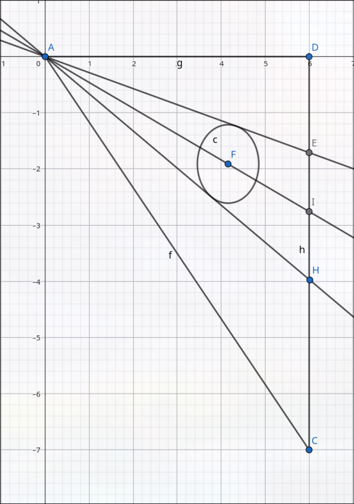
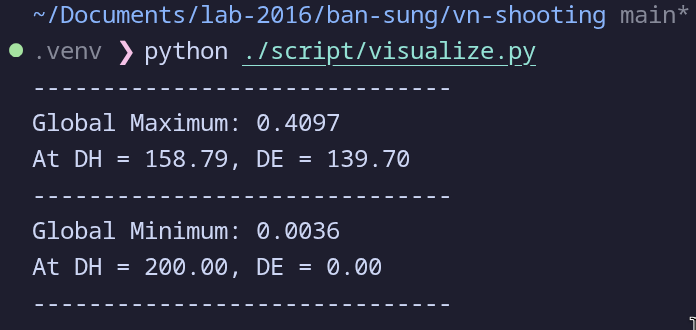

# Tính toán tọa độ tâm đường tròn $F(x_c, y_c)$

Theo định lý Pytago

$$
AE = \sqrt{AD^2 + DE^2}
$$

$$
AH = \sqrt{AD^2 + DH^2}
$$

$$
EH = DH - DE
$$

## 1. Tính tọa độ x của tâm viên đạn ($x_c$)

Chọn điểm $A$ $(0,0)$ ở gốc tọa độ. Phương trình dạng chuẩn cho hai đường thẳng AE và AH ($Ax + By = 0$) là:

1.  Line AE: $DE \cdot x + AD \cdot y = 0$
2.  Line AH: $DH \cdot x + AD \cdot y = 0$
   

Khoảng cách $d$ từ một điểm $(x_c, y_c)$ tới đường thẳng có phương trình $Ax + By = 0$ được định nghĩa bởi $d = \frac{|Ax_c + By_c|}{\sqrt{A^2+B^2}}$.

Khoảng cách từ tâm đường tròn tới AE và AH lần lượt là:

$$
r = -\frac{DE \cdot x_c + AD \cdot y_c}{AE} \quad \text{Khoảng cách tới AE (1)}
$$

$$
r = \frac{DH \cdot x_c + AD \cdot y_c}{AH} \quad \text{Khoảng cách tới AH (2)}
$$

Từ (1) và (2):

1.  $r \cdot AE = -DE \cdot x_c - AD \cdot y_c$
2.  $r \cdot AH = DH \cdot x_c + AD \cdot y_c$

Cộng hai vế của 2 phương trình trên ta có:

$$
r(AE) + r(AH) = (-DE \cdot x_c + DH \cdot x_c) + (-AD \cdot y_c + AD \cdot y_c)
$$

$$
r(AE + AH) = x_c(DH - DE)
$$

Ta lại có:

$$
AE = \sqrt{AD^2 + DE^2}
$$

$$
AH = \sqrt{AD^2 + DH^2}
$$

Vậy giá trị của $x_c$:

$$
x_c =f(DH,DE)= r \cdot \frac{\sqrt{AD^2 + DE^2} + \sqrt{AD^2 + DH^2}}{DH - DE} (3)
$$

## 2. Tính tọa độ y ($y_c$)

Tâm đường tròn nằm trên đường phân giác của góc  $\angle EAH$. Theo tính chất của đường phân giác trong tam giác:

$$
\frac{EI}{IH} = \frac{AE}{AH} \quad \text{Vì I là giao điểm của phân giác với EH}
$$

### Bổ đề - tìm tọa độ của điểm I

Nếu 1 điểm I chia đoạn thẳng EH thành 2 phần có tỉ lệ m:n thì tọa độ $y$ của của điểm I sẽ được tính theo công thức: 

$$
y_I = \frac{m \cdot y_2 + n \cdot y_1}{m + n}
$$

Với

1. Điểm E có tọa độ $y_1$.
2. Điểm H có tọa độ $y_2$.
3. Tỉ lệ:

$$
\frac{\text{Khoảng cách từ } y_1 \text{ tới } y_I}{\text{Khoảng cách từ } y_I \text{ tới } y_2} = \frac{m}{n}
$$

#### Chứng minh
Theo đề bài ta có:

$$
\frac{y_I - y_1}{y_2 - y_I} = \frac{m}{n}
$$

Ta sẽ cố gắng cô lập $y_I$

Nhân chéo và khai triển ta có

$$
n \cdot (y_I - y_1) = m \cdot (y_2 - y_I)
$$

$$
n \cdot y_I - n \cdot y_1 = m \cdot y_2 - m \cdot y_I
$$

Cộng $n \cdot y_1$ và $m \cdot y_I$ ở cả hai vế

$$
n \cdot y_I+ m \cdot y_I = m \cdot y_2 + n \cdot y_1
$$

Nhóm ở vế trái

$$
y_I \cdot (n + m) = m \cdot y_2 + n \cdot y_1
$$

Chia $(n + m)$ cho cả 2 vế

$$
y_I = \frac{m \cdot y_2 + n \cdot y_1}{m + n}
$$

Suy ra tọa độ của điểm I trong trường hợp này

$$
y_I = \frac{DE \cdot AH + DH \cdot AE}{AH + AE}
$$

### Tìm tọa độ của tâm F

Rõ ràng điểm F nằm trên đường AI, mà ta đã biết tọa độ x của điểm F, vậy nên ta sẽ tính tọa độ y dựa vào độ đốc của đường AI

Độ dốc của AI:

$$
Slope=\frac {y_I}{AD} = \frac {1}{AD}\frac{DE \cdot AH + DH \cdot AE}{AH + AE}
$$

Từ độ dốc của AI, ta có thể tìm tọa độ y của tâm F như sau

$$
y_c = \text{Slope} \cdot x_c
$$

Khai triển ta có

$$
y_c = \underbrace{\left[ - \frac{1}{AD} \cdot \frac{DE \cdot AH + DH \cdot AE}{\mathbf{AE + AH}} \right]}_{\text{Slope}} \times \underbrace{\left[ r \cdot \frac{\mathbf{AE + AH}}{DH - DE} \right]}_{x_c}
$$

Giản ước AE+AH ở cả tử và mẫu

$$
y_c = \frac{1}{AD} \cdot (DE \cdot AH + DH \cdot AE) \cdot \frac{r}{DH - DE}
$$

Hay

$$
y_c = \frac{r}{AD} \cdot \left( \frac{DE \cdot \sqrt{AD^2 + DH^2} + DH \cdot \sqrt{AD^2 + DE^2}}{DH - DE} \right)
$$

# Tính toán sai số cho $x_c$ và $y_c$

Với các đại lượng đo được ngoài thực tế $DH$ và $DE$, để dễ viết công thức hơn em quy ước luôn
1. Các giá trị hằng số
    * $L = AD$
    * $r$ bán kính của viên đạn
2. Các biến đo được
    * $u = DH$
    * $v = DE$
3. Giá trị cạnh huyền được tính gián tiếp
    * $S_u = AH = \sqrt{L^2 + u^2}$
    * $S_v = AE = \sqrt{L^2 + v^2}$
4. Sai số đo ảnh của 2 biến đo
    * $\delta$ (thực tế vì cách đặt LED nên $\Delta DH = \Delta DE = \delta$)

Vì tọa độ $x_c$ và $y_c$ được tính gián tiếp nhờ $u$ và $v$ nên sai số của chúng đều được tính theo
$$\Delta F \approx \left| \frac{\partial F}{\partial u} \right|\delta + \left| \frac{\partial F}{\partial v} \right|\delta$$

### 2. Tính toán sai số $x_c$

$$x_c = r \cdot \frac{S_u + S_v}{u - v}$$

#### Bước 1: Tính đạo hàm riêng với $u$ ($DH$)
Luật đạo hàm phân số $\left( \frac{f}{g} \right)' = \frac{f'g - fg'}{g^2}$

Đạo hàm tử số

$f = r(S_u + S_v) \implies f'_u = r(\frac{u}{S_u})$

Đạo hàm mẫu số

$g = (u - v) \implies g'_u = 1$

$$
\frac{\partial x_c}{\partial u} = \frac{r\frac{u}{S_u}(u - v) - r(S_u + S_v)}{(u - v)^2}
$$

Chia cả tử và mẫu cho $\frac{r}{u - v}$:
$$
\frac{\partial x_c}{\partial u} = \frac{r}{u - v} \left[ \frac{u}{S_u} - \frac{S_u + S_v}{u - v} \right]
$$

#### Bước 2: Tính đạo hàm riêng với $v$ ($DE$)

Đạo hàm tử số $f = r(S_u + S_v) \implies f'_v = r(\frac{v}{S_v})$

Đạo hàm mẫu số $g = (u - v) \implies g'_v = -1$

$$
\frac{\partial x_c}{\partial v} = \frac{r\frac{v}{S_v}(u - v) - r(S_u + S_v)(-1)}{(u - v)^2}
$$
$$
\frac{\partial x_c}{\partial v} = \frac{r(u - v)\frac{v}{S_v} + r(S_u + S_v)}{(u - v)^2}
$$

Chia cả tử và mẫu cho $\frac{r}{u - v}$:
$$
\frac{\partial x_c}{\partial v} = \frac{r}{u - v} \left[ \frac{v}{S_v} + \frac{S_u + S_v}{u - v} \right]
$$

#### Tổng sai số $\Delta x_c$

$$
\begin{split}
\Delta x_c &= \delta \cdot \frac{r}{DH - DE} \left( \left| \frac{DH}{\sqrt{AD^2+DH^2}} - \frac{\sqrt{AD^2+DH^2} + \sqrt{AD^2+DE^2}}{DH - DE} \right| \right. \\
&\quad + \left. \left| \frac{DE}{\sqrt{AD^2+DE^2}} + \frac{\sqrt{AD^2+DH^2} + \sqrt{AD^2+DE^2}}{DH - DE} \right| \right)
\end{split}
$$

---

### 3. Tính toán sai số $y_c$

$$y_c = \frac{r}{L} \cdot \frac{v S_u + u S_v}{u - v}$$
Đặt $k = \frac{r}{L}$, $N = v S_u + u S_v$, $D = u - v$
Hàm số trở thành $k \cdot \frac{N}{D}$

#### Bước 1: Tính đạo hàm riêng với $u$ ($DH$)
Vì $k$ là hằng số, ta chỉ quan tâm đạo hàm của $\frac{N}{D}$

Đạo hàm tử số

$\frac{\partial N}{\partial u} = v \frac{\partial S_u}{\partial u} + S_v \cdot 1 = v \frac{u}{S_u} + S_v$

Đạo hàm mẫu số

$\frac{\partial D}{\partial u} = 1$

Từ luật đạo hàm phân số đã nêu:
$$
\frac{\partial y_c}{\partial u} = k \cdot \frac{(u - v)(v \frac{u}{S_u} + S_v) - (v S_u + u S_v)}{(u - v)^2}
$$

Rút gọn tử số:
$$
\text{TS} = (u - v)\frac{uv}{S_u} + (u - v)S_v - v S_u - u S_v
$$
$$
\text{TS} = \frac{uv(u - v)}{S_u} + u S_v - v S_v - v S_u - u S_v
$$
$$
\text{TS} = \frac{uv(u - v)}{S_u} - v(S_u + S_v)
$$

Kết quả:
$$
\frac{\partial y_c}{\partial u} = \frac{r}{L(u - v)^2} \left[ \frac{uv(u - v)}{S_u} - v(S_u + S_v) \right]
$$

#### Bước 2: Tính đạo hàm riêng với $v$ ($DE$)
Tương tự phần trên

Đạo hàm tử

$\frac{\partial N}{\partial v} = 1 \cdot S_u + u \frac{\partial S_v}{\partial v} = S_u + u \frac{v}{S_v}$

Đạo hàm mẫu

$\frac{\partial D}{\partial v} = -1$

Đạo hàm phân số
$$
\frac{\partial y_c}{\partial v} = k \cdot \frac{(u - v)(S_u + \frac{uv}{S_v}) - (v S_u + u S_v)(-1)}{(u - v)^2}
$$

Rút gọn tử số
$$
\text{TS} = (u - v)S_u + \frac{uv(u - v)}{S_v} + v S_u + u S_v
$$
$$
\text{TS} = u S_u - v S_u + \frac{uv(u - v)}{S_v} + v S_u + u S_v
$$
$$
\text{TS} = u(S_u + S_v) + \frac{uv(u - v)}{S_v}
$$

Kết quả
$$
\frac{\partial y_c}{\partial v} = \frac{r}{L(u - v)^2} \left[ u(S_u + S_v) + \frac{uv(u - v)}{S_v} \right]
$$

#### Tổng sai số $\Delta y_c$
$$
\Delta y_c = \frac{\delta \cdot r}{L(DH - DE)^2} \left( \left| \Omega_1 \right| + \left| \Omega_2 \right| \right)
$$

Với

$\Omega_1 = \frac{DH \cdot DE(DH - DE)}{AH} - DE(AH + AE)$

$\Omega_2 = DH(AH + AE) + \frac{DH \cdot DE(DH - DE)}{AE}$

## Kết luận

Để đạt được độ chính xác 0.4mm (tọa độ x) thì độ phân giải của cảm biến IR ở hai bên phải là 0.01mm, điều này là không thể với cách làm sử dụng giá trị nhị phân 0-1 từ các cảm biến

